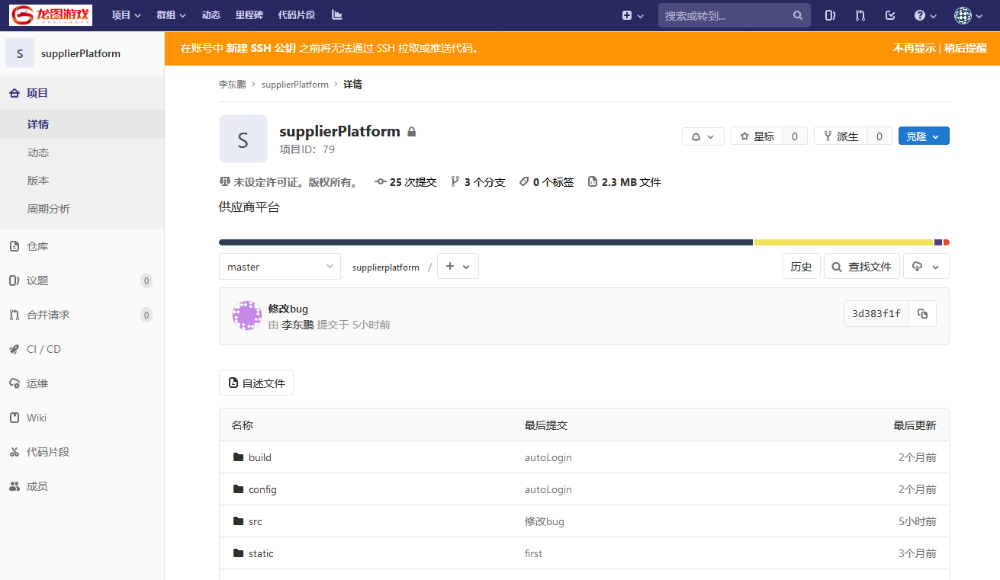
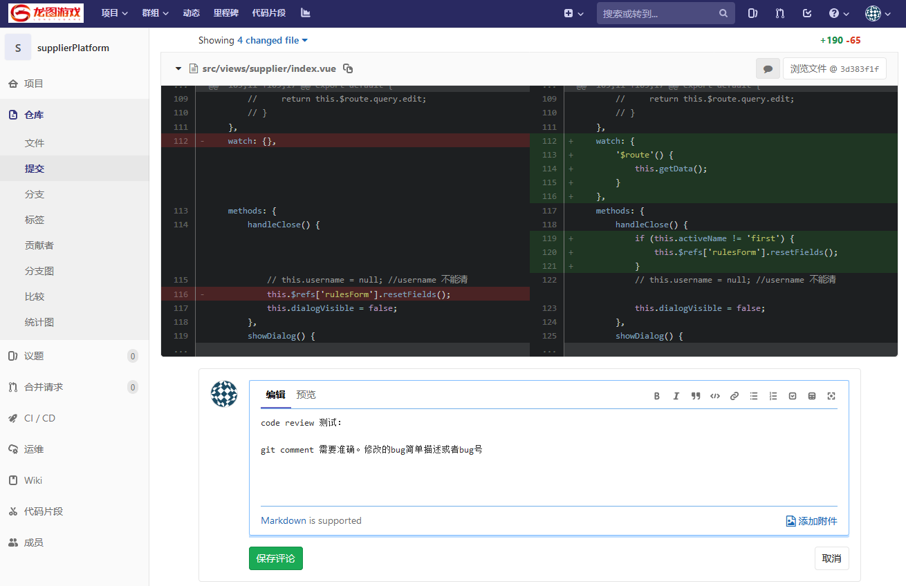
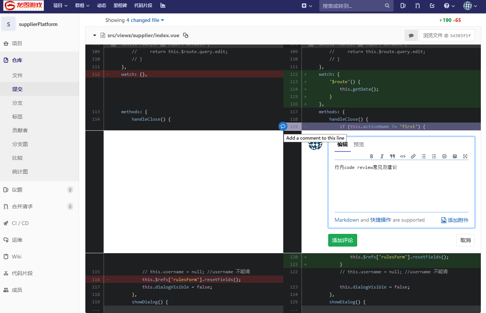
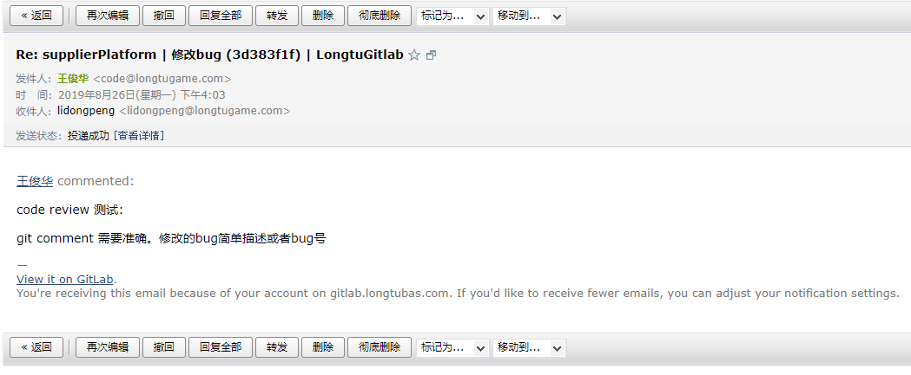

#  使用 Gitlab 做 Code Review

## 设置 git 客户端

在参与 code review 流程前，我们需要保证开发人员的 git 客户端的用户信息正确，否则开发人员将收不到邮件提醒。

进入你的项目目录，使用文本编辑器打开 `.git/config` 文件，在文件末尾添加用户信息：

```ini
[core]
        repositoryformatversion = 0
        filemode = false
        bare = false
        logallrefupdates = true
        symlinks = false
        ignorecase = true
[remote "origin"]
        url = git@gitlab.longtubas.com:root/example.git
        fetch = +refs/heads/*:refs/remotes/origin/*
[branch "master"]
        remote = origin
        merge = refs/heads/master
[user]
        name = 王俊华
        email = wangjunhua@longtugame.com
```

当然，你也可以使用 git 命令行设置用户信息（去掉 `--global` 就是只针对当前项目设置，否则是全局设置）：

```bash
  git config --global user.email "you@example.com"
  git config --global user.name "Your Name"
```


## Gitlab 项目

登录 gitlab 网站：https://gitlab.longtubas.com，你将看到你自己的项目和你有 review 或查看权限的项目。进入某一个项目，查看开发人员的代码提交：



点击开发人员的某次提交链接，或者进入动态查看开发人员的提交历史并点击某个提交链接，或者选择一个文件查看该文件的提交历史并点击某个提交链接，都可以查看提交详情页面，在这里我们就可以进行 code review 了。我们可以对整个提交写 code review comment：



我们也可以对某些代码行输入 comment：



写完评论并点击“添加评论”按钮提交后，代码提交者会收到 code reivew 的邮件：



邮件里有 code review 的评论内容以及指向 Gitlab 代码详情页的链接。