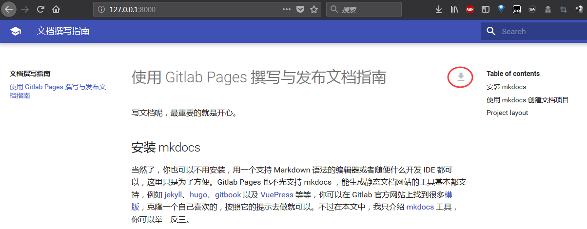
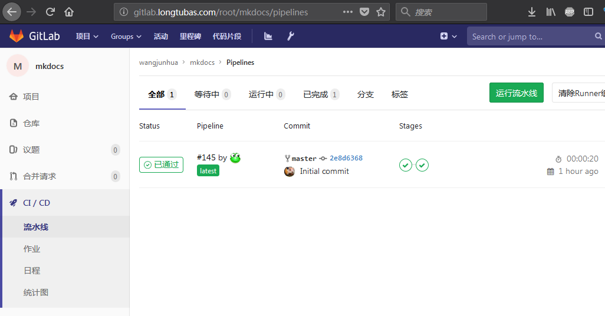
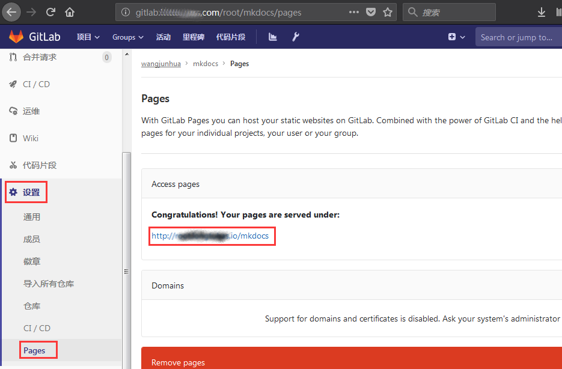

# 使用 Gitlab Pages 撰写与发布文档指南

写文档呢，最重要的就是开心。

如果你不想安装一堆软件，可以直接拉到最下面的[快速开始](#quick_start)

## 安装 mkdocs

当然了，你也可以不用安装，用一个支持 Markdown 语法的编辑器或者随便什么开发 IDE 都可以，这里只是为了方便。Gitlab Pages 也不光支持 mkdocs ，能生成静态文档网站的工具基本都支持，例如 [jekyll](https://jekyllrb.com/)、[hugo](https://gohugo.io/)、[gitbook](https://legacy.gitbook.com/) 以及 [VuePress](https://vuepress.vuejs.org/zh/) 等等，你可以在 Gitlab 官方网站上找到很多[模版](https://gitlab.com/pages)，克隆一个自己喜欢的，按照它的提示去做就可以。不过在本文中，我只介绍 [mkdocs](https://www.mkdocs.org) 工具，你可以举一反三。

首先，你需要安装 [python](https://www.python.org/)

!!! note 关于版本
    版本在2.7以上即可，推荐安装高版本的（后面引入的PDF导出功能只支持 python 3.4 以上）。同时安装 python 的包管理工具 pip。

```
$ python --version
Python 3.7.0

$ pip --version
pip 10.0.1 from d:\python37\lib\site-packages\pip (python 3.7)
```

Windows从官网上下载 python 安装包就可以，然后我们安装完以后升级一下 pip：

```
python -m pip install --upgrade pip
```

有了 pip，安装 mkdocs 就非常简单：

```
pip install mkdocs
```

检查一下 mkdocs 安装正确：

```
$ mkdocs --version
mkdocs, version 1.0.4 from d:\python37\lib\site-packages\mkdocs (Python 3.7)
```


## 使用 mkdocs 创建文档项目

```
mkdocs new my-project
cd my-project
```

上面两行命令就创建了一个文档项目的框架，你可以修改 index.md，添加新的 Markdown 文件……


进入你的新文档项目目录，执行 `mkdocs serve` ，一个本地的服务器就启动起来了，你可以在浏览器里访问 http://127.0.0.1:8000 ：

```
$ mkdocs serve
INFO    -  Building documentation...
INFO    -  Cleaning site directory
[I 160402 15:50:43 server:271] Serving on http://127.0.0.1:8000
[I 160402 15:50:43 handlers:58] Start watching changes
[I 160402 15:50:43 handlers:60] Start detecting changes
```

mkdocs 命令参考：

* `mkdocs new [dir-name]` - 创建一个新项目
* `mkdocs serve` - 启动即时重载文档服务器
* `mkdocs build` - 编译文档为静态文件站点
* `mkdocs help` - 打印帮助信息


## 加入 PDF 导出功能

因为我们想加入 PDF 导出的支持，所以这里安装 [Weasyprint](https://weasyprint.readthedocs.io/en/latest/install.html) 程序：

```
pip install WeasyPrint
```

安装 [GTK+ for Windows Runtime Environment](https://weasyprint.readthedocs.io/en/latest/install.html#gtk64installer)；

然后安装 pdf-export 插件和它目前唯一支持的 mkdocs 主题 material：

```
pip install mkdocs-material mkdocs-pdf-export-plugin
```

为了支持中文，我们添加一个额外的 css 样式表文件 `extra.css` 到 `docs/stylesheets/`：

```
@page {
    size: a4 portrait;
    margin: 25mm 10mm 25mm 10mm;
    counter-increment: page;
    font-family: "Microsoft YaHei", "Hiragino Sans GB", "WenQuanYi Micro Hei", "Roboto","Helvetica Neue",Helvetica,Arial,sans-serif;
    white-space: pre;
    color: grey;
    @top-left {
        content: '© 2018 Longtugame';
    }
    @top-center {
        content: string(chapter);
    }
    @top-right {
        content: '页：' counter(page);
    }
}
```

再修改 `mkdocs.yml`，添加 `theme` 为 `material`，添加上面的 `extra.css`，添加 `pdf-export` 插件：

```
markdown_extensions:
  - smarty
  - toc:
      permalink: True
      separator: "_"
site_name: my-project
theme: material
extra_css:
  - 'stylesheets/extra.css'
plugins:
  - search
  - pdf-export
```

再次访问 http://127.0.0.1:8000 ，应该能看到 PDF 的下载链接了：




## 发布到 Gitlab Pages

首先呢，你得有一个 Gitlab 帐号，在 [Gitlab 站点](http://gitlab.com)上创建一个文档项目，然后把前面的内容提交到这个项目。

光这样的话 Gitlab 是不会自动为我们完成 Pages 的页面创建的，我们需要再在项目根目录创建一个 `.gitlab-ci.yml` 文件：

```
image: mkdocs

before_script:
  ## - pip install mkdocs
  ## Add your custom theme if not inside a theme_dir
  ## (https://github.com/mkdocs/mkdocs/wiki/MkDocs-Themes)
  ## - pip install mkdocs-material

pages:
  script:
  - mkdocs build
  - mv site public
  artifacts:
    paths:
    - public
  only:
  - master

```

提交这个文件到 Gitlab，Gitlab 就会自动执行 CI 流程了：



如果一切顺利，你的文档站就发布成功了。那么去哪里看到它呢？打开你的项目的“设置” -> “Pages”，就可以看到 URL 了：




## 快速开始 Quick Start

直接下载[本项目文件](https://github.com/tangramor/mkdocs/archive/master.zip)，稍作修改，提交到你的文档项目，就可以啦。


